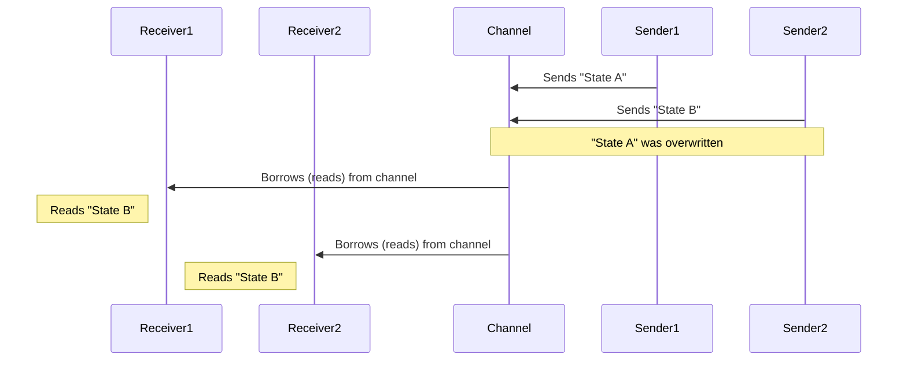

# Watch channel

```mermaid
sequenceDiagram
    participant Receiver1
    participant Receiver2
    participant Channel
    participant Sender1
    participant Sender2

    Sender1 ->> Channel: Sends "State A"
    Sender2 ->> Channel: Sends "State B"
    Note over Channel, Sender2: "State A" was overwritten
    Channel ->> Receiver1: Borrows (reads) from channel
    Note left of Receiver1: Reads "State B"
    Channel ->> Receiver2: Borrows (reads) from channel
    Note left of Receiver2: Reads "State B"
```