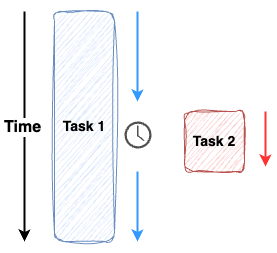

# Asynchronous Execution

A task is executed with breaks in between, which are usually due to waiting for something to complete.

While waiting, the program can perform other tasks.

This allows the program to jump between execution of totally unrelated functions.

We're not talking about Task 1 calling Task 2.

We're talking about, we have some reason to wait in Task 1,
and then, a totally unrelated Task 2 is able to start execution.

