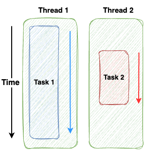

# Parallel Execution

Requires an individual core on the CPU for each task (without accounting for [hyper-threading](https://en.wikipedia.org/wiki/Hyper-threading#:~:text=Hyper%2Dthreading%20(officially%20called%20Hyper,once)%20performed%20on%20x86%20microprocessors.))

The issue is that switching between threads is **expensive!**

Each thread has its own stack that needs to be copied

The more threads, the more the OS needs to switch

