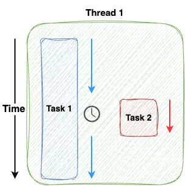

# Async execution

Multiple tasks on same thread -> need to be managed

Tasks created and managed by an async runtime

When thread is active, async runtime decides which task is executed within it

Execution of task is asynchronous (interweaved)

