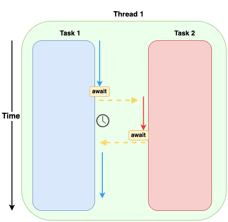

# Async Execution

The `await` keyword yields control of one task

The async runtime decides which other task to work on

A thread can only make progress on one task at a time

Each task can contain multiple operations (futures in Rust)

This is called "driving a future to completion"

