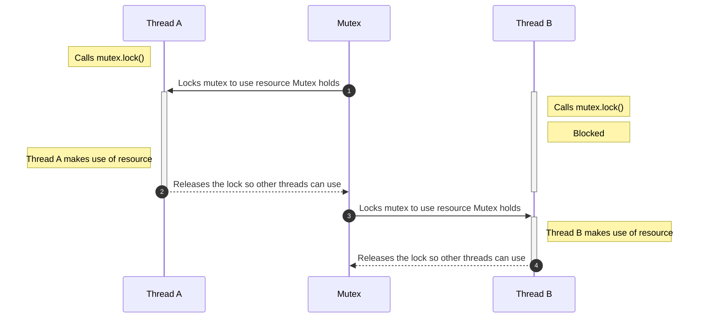

# Sync Mutexes

```mermaid
sequenceDiagram;
    participant Thread A
    participant Mutex
    participant Thread B
    autonumber
    Note left of Thread A: Calls mutex.lock()
    Mutex ->>+ Thread A: Locks mutex to use resource Mutex holds
    activate Thread B
    Note right of Thread B: Calls mutex.lock()
    Note right of Thread B: Blocked
    Note left of Thread A: Thread A makes use of resource
    Thread A -->>- Mutex: Releases the lock so other threads can use
    deactivate Thread B
    Mutex ->>+ Thread B: Locks mutex to use resource Mutex holds
    Note right of Thread B: Thread B makes use of resource
    Thread B -->>- Mutex: Releases the lock so other threads can use
```