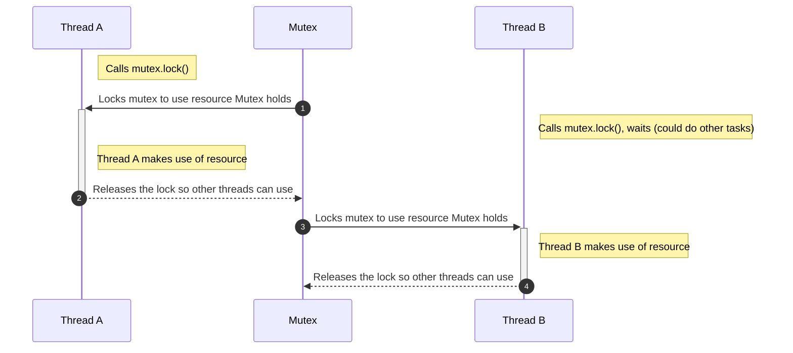

# Async Mutexes

```mermaid
sequenceDiagram;
    autonumber
    Note right of Thread A: Calls mutex.lock()
    Mutex ->>+ Thread A: Locks mutex to use resource Mutex holds
    Note right of Thread B: Calls mutex.lock(), waits (could do other tasks)
    Note right of Thread A: Thread A makes use of resource
    Thread A -->>- Mutex: Releases the lock so other threads can use
    Mutex ->>+ Thread B: Locks mutex to use resource Mutex holds
    Note right of Thread B: Thread B makes use of resource
    Thread B -->>- Mutex: Releases the lock so other threads can use
```