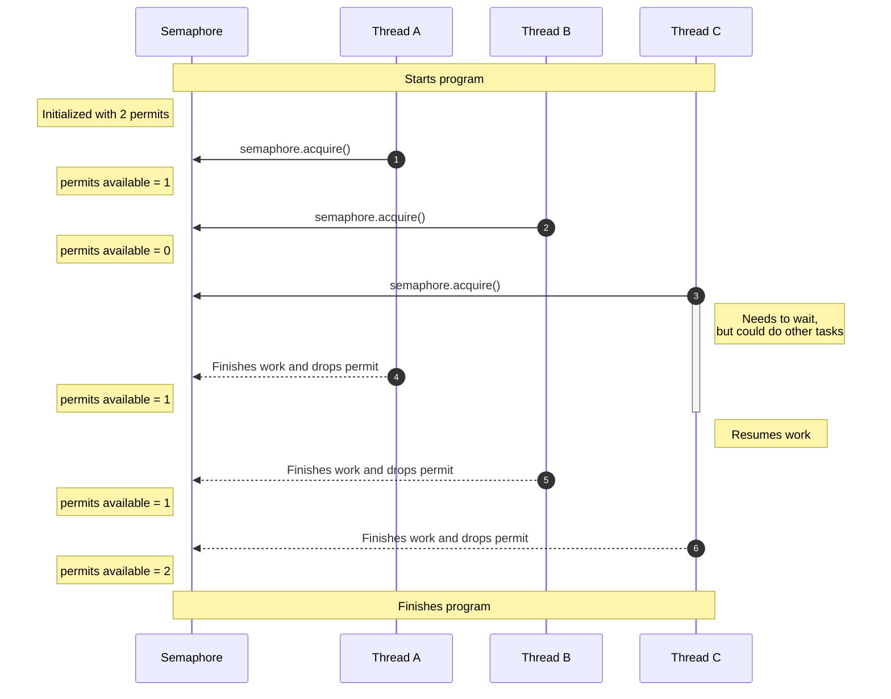

# Semaphore

```mermaid
sequenceDiagram
    autonumber
    participant Semaphore
    participant Thread A
    participant Thread B
    participant Thread C
    
    Note over Semaphore, Thread C: Starts program
    Note left of Semaphore: Initialized with 2 permits
    Thread A ->> Semaphore: semaphore.acquire()
    Note left of Semaphore: permits available = 1
    Thread B ->> Semaphore: semaphore.acquire()
    Note left of Semaphore: permits available = 0
    Thread C ->> Semaphore: semaphore.acquire()
    activate Thread C
    Note right of Thread C: Needs to wait,<br/> but could do other tasks
    Thread A -->> Semaphore: Finishes work and drops permit
    Note left of Semaphore: permits available = 1
    deactivate Thread C
    Note right of Thread C: Resumes work
    Thread B -->> Semaphore: Finishes work and drops permit
    Note left of Semaphore: permits available = 1
    Thread C -->> Semaphore: Finishes work and drops permit
    Note left of Semaphore: permits available = 2
    Note over Semaphore, Thread C: Finishes program
```