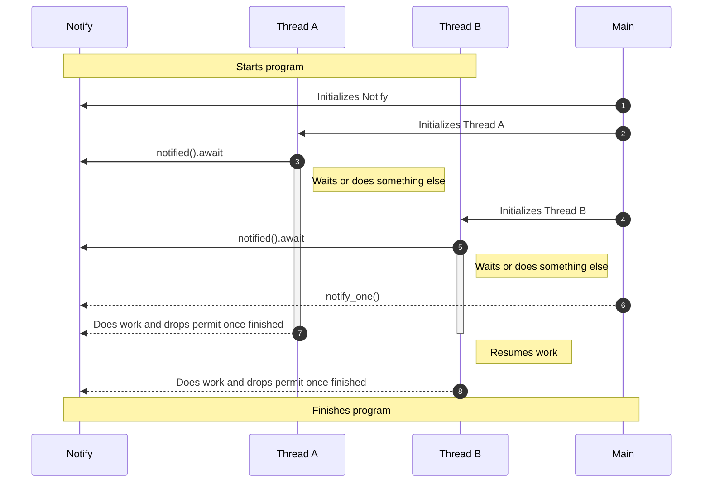

# Notify

```mermaid
sequenceDiagram
    autonumber
    participant Notify
    participant Thread A
    participant Thread B
    participant Main
    
    Note over Notify, Thread B: Starts program
    Main ->> Notify: Initializes Notify
    Main ->> Thread A: Initializes Thread A
    Thread A ->> Notify: notified().await
    activate Thread A
    Note right of Thread A: Waits or does something else
    Main ->> Thread B: Initializes Thread B
    Thread B ->> Notify: notified().await
    activate Thread B
    Note right of Thread B: Waits or does something else
    Main -->> Notify: notify_one()
    Thread A -->> Notify: Does work and drops permit once finished
    deactivate Thread A
    deactivate Thread B
    Note right of Thread B: Resumes work
    Thread B -->> Notify: Does work and drops permit once finished
    Note over Notify, Main: Finishes program
```