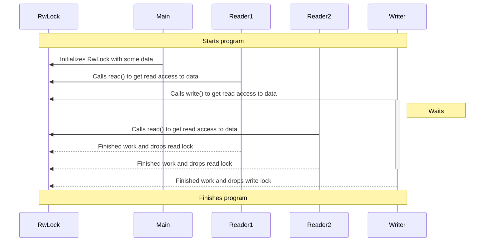

# RwLock

```mermaid
sequenceDiagram
    participant RwLock
    participant Main
    participant Reader1
    participant Reader2
    participant Writer

    Note over RwLock, Writer: Starts program
    Main ->> RwLock: Initializes RwLock with some data
    Reader1 ->> RwLock: Calls read() to get read access to data
    Writer ->> RwLock: Calls write() to get read access to data
    activate Writer
    Note right of Writer: Waits
    Reader2 ->> RwLock: Calls read() to get read access to data
    Reader1 -->> RwLock: Finished work and drops read lock
    Reader2 -->> RwLock: Finished work and drops read lock
    deactivate Writer
    Writer -->> RwLock: Finished work and drops write lock
    Note over RwLock, Writer: Finishes program
```